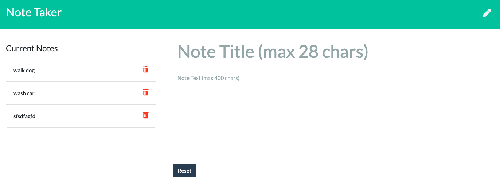

# hw11-note_taker
## Description

Note taker application can be used to write, save, and delete notes. The application has a `db.json` file on the backend that will be used to store and retrieve notes using the `fs` module. The `db.json` file has two examples on there at start.

## User Story

AS A user, I want to be able to write and save notes

I WANT to be able to delete notes I've written before

SO THAT I can organize my thoughts and keep track of tasks I need to complete

## Heroku

Uploaded application to here:

https://guarded-mountain-91375.herokuapp.com/

## Screen Shot

